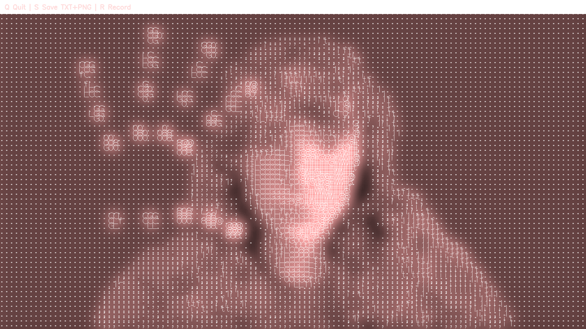

# ASCII Glow Camera


Real-time webcam ASCII renderer with:

- Hybrid body + hand segmentation (MediaPipe)
- Pink glow shader
- Transparent PNG export
- TXT export of raw ASCII frames
- Real-time FPS-accurate MP4 recording (no sped-up playback)
- Simple keyboard UI

---

## Features

| Capability | Supported |
|------------|-----------|
| Real-time ASCII camera | ✔ |
| Body segmentation | ✔ |
| Hand segmentation | ✔ (keeps fingers visible) |
| Pink glow effect | ✔ |
| Transparent PNG export | ✔ |
| TXT output | ✔ |
| Video recording | ✔ (auto-FPS safe, no fast playback) |

---

## Installation

```
git clone https://github.com/devdestro/Realtime-ASCII-Effect-Cam.git
cd ascii-camera
pip install -r requirements.txt
```

Requirements:

```
Python 3.9+
opencv-python
mediapipe
numpy
```

---

## Run

```
python ascii_cam.py
```

---

## Controls

| Key | Action |
|-----|--------|
| **Q** | Quit |
| **S** | Save ASCII `.txt` + transparent `.png` |
| **R** | Start/stop video recording (`.mp4`) |

Output examples:

```
ascii_frame_0.txt
ascii_frame_0.png
ascii_record_0.mp4
```

---

## How recording avoids speed-up

The script measures **real loop framerate**, then opens `cv2.VideoWriter()` using the **actual measured FPS**, not a fixed constant.

This prevents the classic OpenCV problem where output video plays too fast.

---

## Project structure

```
📦 ascii-camera
 ├─ ascii_cam.py
 ├─ requirements.txt
 ├─ README.md
 ├─ LICENSE
 └─ .gitignore
```

---

## License

MIT License — free for personal and commercial use.

---

## Author

Yunus Emre Kuru

```
GitHub: https://github.com/devdestro
```
